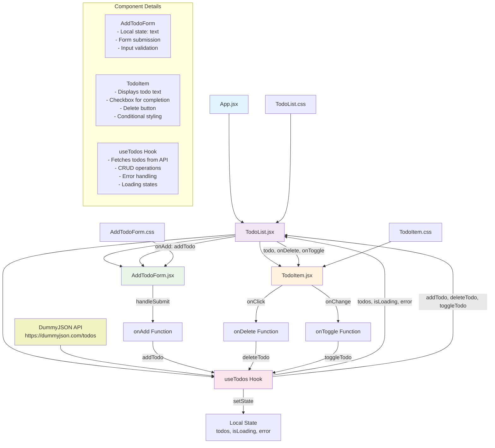

# Todo List App - React + Vite

A React-based Todo List application that demonstrates component composition, state management, and API integration.

## Component Tree + Data Flow Diagram

## Architecture Overview

### Component Hierarchy
- **App.jsx**: Root component that renders the TodoList
- **TodoList.jsx**: Main container component that manages the todo list display
- **AddTodoForm.jsx**: Form component for adding new todos
- **TodoItem.jsx**: Individual todo item component with toggle and delete functionality

### Data Flow
1. **Initial Load**: `useTodos` hook fetches data from DummyJSON API
2. **State Management**: Hook manages todos array, loading, and error states
3. **User Actions**: Components trigger functions passed down as props
4. **State Updates**: Hook functions update local state and sync with API
5. **Re-rendering**: State changes trigger component re-renders

### Key Features
- **API Integration**: Fetches todos from external API
- **CRUD Operations**: Create, Read, Update, Delete functionality
- **Error Handling**: Graceful error states and fallbacks
- **Loading States**: Shows loading indicator during API calls
- **Local State**: Optimistic updates for better UX