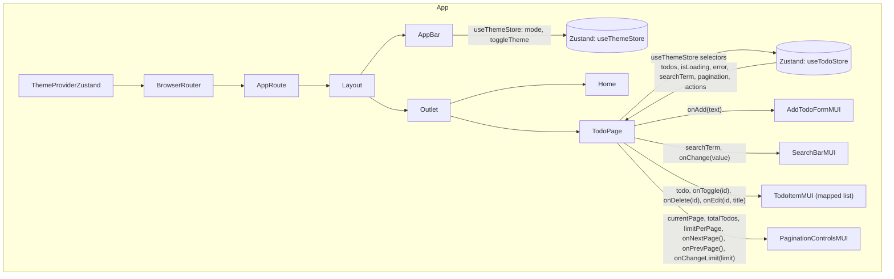

# Student Portfolio - React SPA

A modern React Single Page Application demonstrating full-stack frontend development with Material UI, Zustand state management, React Router, and theme switching.

---

## Component (UI) Tree



**Component Details:**

### Page Components
- **Home** - Landing page with project overview
- **TodoPage** - Main MUI Todo List connected to Zustand
- **Lab4** - Original Todo List for comparison

### Todo Components (MUI)
- **TodoItemMUI** - Card with checkbox, edit/delete buttons, inline editing
- **AddTodoFormMUI** - TextField + Button for adding todos
- **SearchBarMUI** - Search input with icon
- **PaginationControlsMUI** - Navigation and items-per-page selector

### Layout Components
- **Layout** - App shell with AppBar and content area
- **AppBar** - Navigation links and theme toggle button
- **AppRoute** - Route definitions

---

## Архітектурні рішення

### State Management
**Zustand** was chosen for global state:
- **useTodoStore.js** - Todos, pagination, search, CRUD operations
- **useThemeStore.js** - Theme mode with localStorage persistence

**Why Zustand?**
- Minimal boilerplate compared to Redux
- No Provider nesting (unlike Context API)
- Built-in devtools support
- Easy selective subscriptions (prevents unnecessary re-renders)
- Built-in persistence middleware

### Optimization Strategy
1. **Zustand Selectors** - Components subscribe only to needed state slices
   ```jsx
   const todos = useTodoStore((state) => state.todos);
   ```
2. **React.memo** - All child components memoized to prevent re-renders
3. **Optimistic Updates** - UI updates immediately, syncs with API in background
4. **Server-side Pagination** - Fetch only needed items from API

### Data Flow
```
User Action → Zustand Store Action → Optimistic State Update → API Call → Sync/Revert
```

### Routing Architecture
- **React Router v6** with nested routes
- Layout component wraps all pages

### Theme System
- **MUI Theme** with custom light/dark palettes
- **ThemeProviderZustand** reads mode from Zustand
- All components use theme tokens (`'background.paper'`, `'text.primary'`, etc.)

---

## Вибір компонентної бібліотеки

### Material UI (MUI)

**Pros:**
- **Production-ready** - Used by Google, Netflix, NASA
- **Complete ecosystem** - Components, icons, theming, utilities
- **Excellent theming** - Built-in dark mode support
- **Accessibility** - ARIA attributes, keyboard navigation
- **TypeScript support** - Full type definitions
- **Customization** - `sx` prop for inline styles with theme access

**Why MUI?**
- **vs Ant Design** - Better theme customization, more modern design
- **vs Chakra UI** - Larger component library, better ecosystem
- **vs shadcn/ui** - No need for TypeScript setup, faster implementation

**Key MUI Features Used:**
- **Components**: Button, TextField, Card, Checkbox, IconButton, AppBar, Paper, Typography
- **Icons**: @mui/icons-material (Edit, Delete, Save, Search, etc.)
- **Theming**: createTheme, ThemeProvider, CssBaseline
- **Layout**: Box, Stack, Container (flexbox utilities)
- **Styling**: `sx` prop with theme tokens

---

## Original Lab 4 Documentation

A React-based Todo List application that demonstrates component composition, state management, and API integration.

## Component Tree + Data Flow Diagram


## Architecture Overview

### Component Hierarchy
- **App.jsx**: Root component that renders the TodoList
- **TodoList.jsx**: Main container component that manages the todo list display
- **AddTodoForm.jsx**: Form component for adding new todos
- **TodoItem.jsx**: Individual todo item component with toggle and delete functionality
- **useTodos.js**: Custom hook that handles data fetching. CRUD operations, loading and error states. 

### Data Flow
1. **Initial Load**: `useTodos` hook fetches data from DummyJSON API
2. **State Management**: Hook manages todos array, loading, and error states
3. **User Actions**: Components trigger functions passed down as props
4. **State Updates**: Hook functions update local state and sync with API
5. **Re-rendering**: State changes trigger component re-renders

### Patterns
Container + Presentational Components
Custom Hook
Unidirectional Data Flow
Graceful Degradation
